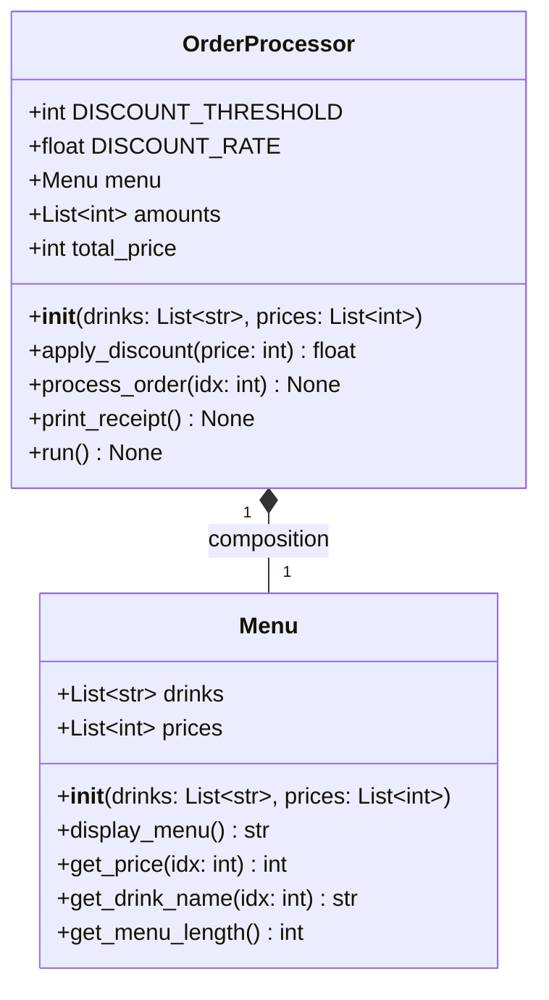

```mermaid
classDiagram
    class Menu {
        +List~str~ drinks
        +List~int~ prices
        +__init__(drinks: List~str~, prices: List~int~)
        +display_menu() str
        +get_price(idx: int) int
        +get_drink_name(idx: int) str
        +get_menu_length() int
    }

    class OrderProcessor {
        +int DISCOUNT_THRESHOLD
        +float DISCOUNT_RATE
        +Menu menu
        +List~int~ amounts
        +int total_price
        +__init__(drinks: List~str~, prices: List~int~)
        +apply_discount(price: int) float
        +process_order(idx: int) None
        +print_receipt() None
        +run() None
    }

    %% Composition (Strong Has-a) 관계: OrderProcessor가 Menu의 생명주기를 관리함
    OrderProcessor "1" *-- "1" Menu : composition
```